# jomiel

`jomiel` is the meta inquiry middleware for distributed systems. It
returns meta data for content on [video-sharing] websites (e.g.
YouTube) and runs as a service, responding to client inquiries.

Two core technologies serve as a basis for `jomiel`:

- [Protocol Buffers] for platform-independent data serialization
- [ZeroMQ] as the messaging library

The client applications can be written in modern [languages][examples]
for most platforms.

`jomiel` is a spiritual successor to (now defunct) [libquvi].



## Table of Contents

<!-- vim-markdown-toc GFM -->

- [Features](#features)
- [Getting started](#getting-started)
  - [Website coverage](#website-coverage)
  - [If you are contributing new plugins](#if-you-are-contributing-new-plugins)
- [HOWTO](#howto)
- [Versioning](#versioning)
- [License](#license)
- [Acknowledgements](#acknowledgements)
  - [Subprojects](#subprojects)

<!-- vim-markdown-toc -->

## Features

- Plug-in system enabling customization to add support for media hosts
- Support for authentication and encryption (CURVE and SSH)
- [ZeroMQ] supports every modern language and platform
- [Protocol Buffers] are language-neutral, platform-neutral
- Highly configurable
- Runs as a service

## Getting started

- `jomiel` requires [Python] 3.6+

To install `jomiel` from from [PyPI]:

```shell
pip install jomiel        # For the latest release
jomiel                    # Starts the service
```

To run `jomiel` from the repository:

- Make sure you have installed protobuf compiler (debian:
  protobuf-compiler)

```shell
git clone https://github.com/guendto/jomiel.git && cd jomiel
pip install -r ./requirements.txt
python setup.py build_py    # Generate the protobuf message bindings
python jomiel               # Starts the service
```

`jomiel` is still a young project. Once you have `jomiel` running, you
can experiment sending inquries to it:

- [examples] - the demo programs written in most modern languages
- [yomiel] - the pretty printer for `jomiel` messages

### Website coverage

```shell
jomiel --plugin-list    # List supported websites
```

The website coverage is currently very limited. The plugins can be
found in the jomiel/plugin/ directory.

- `jomiel` is written in [Python] which is an easy language to learn
- Additional support can be implemented by adding new plugins

### If you are contributing new plugins

- Make sure the site is not dedicated to copyright infringement, be that
  they host the media or the link to it

- Make sure the site is not NSFW

## HOWTO

See [docs/HOWTO](./docs/HOWTO.md).

## Versioning

`jomiel` uses a _date based versioning scheme_.

**Definition**

`y.y.mm.dd(.hhmm)`

**Example**

`Fri 10 Jul 2020 12:05:40 PM EEST` would become:

- `2.0.7.10` (initial release on that day)
- `2.0.7.10.1205` (another release on the same day at 12:05, local time)

**Exception**

When `jomiel` is run from the _repository code_, the combined output of
the commands `git-describe` and the `git-show` will be used for the
version number, instead.

## License

`jomiel` is licensed under the [Apache License version 2.0][aplv2].

## Acknowledgements

`jomiel` uses [pre-commit] and its many hooks to lint and format the
project files. See the .pre-commit-config.yaml file for details.

### Subprojects

`jomiel` subtrees (includes) the following subprojects:

- [jomiel-proto] found in [jomiel/comm/proto/](jomiel/comm/proto/)
- [jomiel-comm] found in [jomiel/comm/](jomiel/comm/)
- [jomiel-kore] found in [jomiel/kore/](jomiel/kore/)

[video-sharing]: https://en.wikipedia.org/wiki/Video_hosting_service
[protocol buffers]: https://developers.google.com/protocol-buffers/
[jomiel-proto]: https://github.com/guendto/jomiel-proto/
[examples]: https://github.com/guendto/jomiel-examples/
[python]: https://www.python.org/about/gettingstarted/
[jomiel-comm]: https://github.com/guendto/jomiel-comm/
[jomiel-kore]: https://github.com/guendto/jomiel-kore/
[yomiel]: https://github.com/guendto/jomiel-yomiel/
[aplv2]: https://www.tldrlegal.com/l/apache2
[pre-commit]: https://pre-commit.com/
[libquvi]: http://quvi.sf.net/
[zeromq]: https://zeromq.org/
[pypi]: https://pypi.org/
